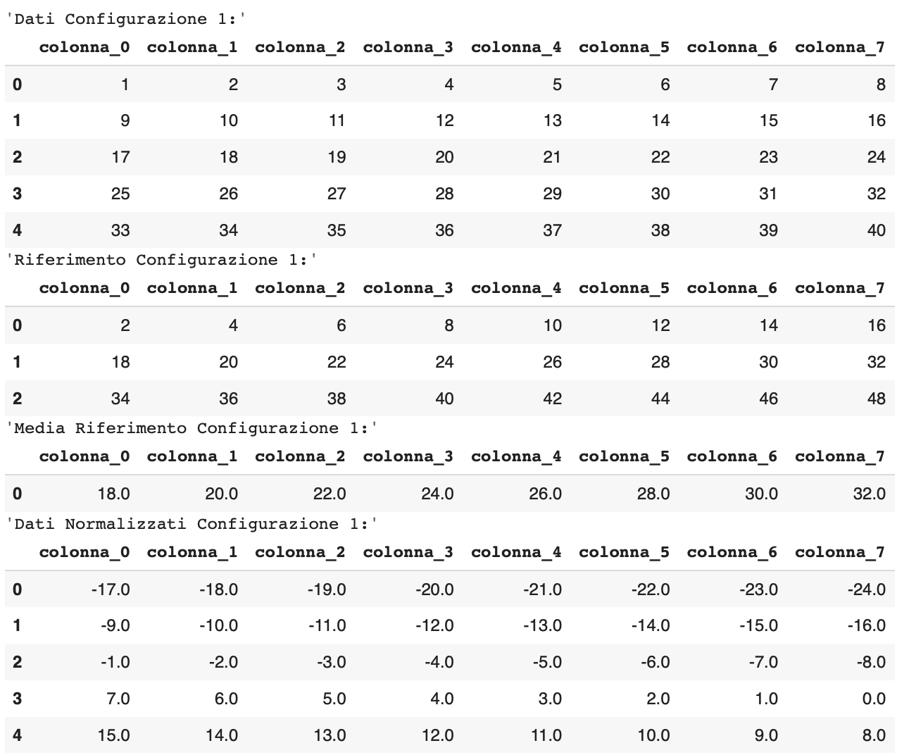

# PHM20200-Data-Challenge
Tale documentazione è una sintesi del file pdf contenente la relazione disponibile all'interno della repository come *ADMT_B_PHM2022_Data_Challenge.pdf*. 
I dataset sono scaricabili ai seguenti link, <a href="https://drive.google.com/drive/folders/189FOG3M9HqIhEr49yUDKxNH_IoeUeUTQ?usp=share_link">1</a> e  <a href="https://drive.google.com/drive/folders/1ekYSxD_LjZWMpBqFYxi0tsHidyiPpFW-?usp=share_link">2</a>.

# Pre-processing
Inizialmente, per ogni sensore, è stata definita una struttura dati tabellare, il dataframe, dove le righe rappresentano le serie temporali delle acquisizioni e le colonne gli istanti temporali. 
Tali dataframe sono stati ottenuti concatenando, lungo le righe, i dati relativi alle configurazioni disponibili. 
Si è deciso di rendere i dati indipendenti dalle configurazioni eseguendo una normalizzazione rispetto ai riferimenti disponibili. 
La normalizzazione ha richiesto, per ogni sensore e configurazione, i seguenti passaggi:
- creazione di due dataframe, uno relativo al training e l'altro relativo ai riferimenti;
- Per ogni colonna del dataframe dei riferimenti, è stata calcolata la media, ottenendo una serie temporale;
- ad ogni riga del dataframe di training, è stata sottratta la serie temporale precedentemente calcolata.

Di seguito, in figura si illustra un esempio di procedura di normalizzazione.
 
Esempio di normalizzazione per una singola configurazione. 

Intuitivamente, eseguire tali passaggi rende le serie temporali indipendenti dalla configurazione, poiché viene eseguita una normalizzazione rispetto ai riferimenti disponibili.  
Nella sezione successiva verranno mostrate le immagini delle serie nel tempo e in frequenza, prima e dopo la normalizzazione.

# Feature Temporali
Le feature calcolate possono essere divise in 4 sottogruppi:
- statistiche: 
    - Massimo e Minimo;
    - Kurtosi: lunghezza delle code;
    - Skewness: asimmetria di un segnale;
    - Primo Quartile, Mediana e Terzo Quartile;
- Impulsive: 
    - Crest Factor: rapporto tra il picco massimo e il valore quadratico medio del segnale;
    - Impulse Factor: rapporto tra il picco massimo e il valore medio del segnale;
- Autocorrelazione: calcolata per un numero di lag pari a 1, 5, 10, 20, 50. Tali valori sono stati scelti tramite una grid search.
- Finestra Temporale: è stata definita una finestra temporale scorrevole lungo tutti i campioni della serie senza sovrapposizione. La lunghezza della finestra è stata scelta pari a 50 campioni, dopo un confronto tra diverse lunghezze, poiché questo valore porta a migliori risultati durante la fase di valutazione dei modelli.
Per ogni porzione del segnale finestrato sono state calcolate le seguenti feature statistiche:
- Massimo e Minimo;
- Media;
- Varianza;
- Skewness;
- Kurtosi;
Dopo aver generato le feature per ogni sensore, sono state concatenate, ottenendo in totale 243 feature nel tempo.

# Feature Spettrali
Le feature in frequenza possono essere divise in 3 gruppi:
- Picco: dopo aver calcolato la trasformata di Fourier del segnale sono state ottenute le ampiezze dei primi 3 picchi relativi e le loro frequenze;
- Statistiche: dopo aver calcolato la trasformata di Fourier del segnale sono state calcolate le stesse feature statistiche descritte nel caso temporale;
- Per finestra: è stata definita una finestra temporale scorrevole lungo tutti i campioni della serie senza sovrapposizione. Anche in questo caso la lunghezza della finestra è stata scelta pari a 50 campioni poiché porta a migliori risultati. Per ogni porzione del segnale finestrato sono stati calcolati i primi due picchi relativi e le frequenze in cui essi compaiono.

Dopo aver generato le feature per ogni sensore, sono state concatenate, ottenendo in tutto 183 feature in frequenza.

# Creazione Dataset di Training
Dopo aver calcolato le feature temporali e spettrali per tutti e 3 i sensori, esse sono state concatenate lungo le colonne in modo da ottenere un dataframe costituito da 426 colonne di feature e una per la classe di guasto. 
Queste operazioni sono state ripetute per ogni configurazione, ottenendo una lista di 5 dataframe, i quali costituiscono i fold utilizzati nell'addestramento dei modelli e testarli tramite CrossValidation. 

# Addestramento e CrossValidation

Seguendo il consiglio fornito dagli autori del documento di accompagnamento, si è deciso di allenare il modello utilizzando una Cross Validation sulle 5 configurazioni, in modo da allenare i modelli su 4 configurazioni e testarle sempre su una configurazione non nota.
Non è stato possibile utilizzare la GridSearchCV fornita da sklearn, perciò è stata definita una funzione che prende in input una lista di dataframe (i dati divisi in base alla configurazione di appartenenza) ed una serie di parametri:
- una pipeline;
- un dizionario contenente i parametri da testare;
- il nome modello da testare;

Tale funzione esegue una ricerca esaustiva generando tutte le possibili combinazioni dei parametri in input ed eseguendo una cross validation sulla lista di dataframe passati in input. 
 
Ciò consente di definire la migliore combinazione, cioè quella con il miglior compromesso tra un alto valore di accuracy ed una bassa varianza durante la cross validation.

# Risultati Miglior Modello
Di seguito sono illustrate le matrici di confusione dell'XGBClassifier (il modello più performante), per ogni iterazione della CrossValidation effettuata sulla combinazione ottima di parametri. Inoltre, sono anche riportate le prime 20 feature ordinate in base alla feature importance.
 
Matrice di confusione ottenuta testando il modello sul fold 1 (Accuracy: 0.954). 
 
Matrice di confusione ottenuta testando il modello sul fold 2 (Accuracy: 0.920). 
 
Matrice di confusione ottenuta testando il modello sul fold 3 (Accuracy: 0.935). 
 
Matrice di confusione ottenuta testando il modello sul fold 4 (Accuracy: 0.947). 

Si può facilmente osservare che il modello è molto performante nella previsione di tutte le classi, escluse le classi 7 e 8, le quali sono spesso confuse tra loro. 
Si può inoltre osservare che le predizioni sono quasi del tutto prive di falsi allarmi, mentre sono presenti alcuni mancati allarmi, soprattutto nella prima fold.  

# Testing
In questo capitolo ogni modello sarà addestrato su tutte le configurazioni utilizzate per la Cross Validation e poi testato su una configurazione mai vista.
 
La particolarità del dataset di test è che solo una parte (circa 20 acquisizioni) è etichettata come classe 1, mentre il restante (circa 3200 acquisizioni) è etichettato con classe 0, la quale corrisponde ad una generica classe tra le 11 disponibili. Perciò il testing che verrà discusso non ha l'obiettivo di valutare l'accuratezza dei modelli, ma solo come le predizioni sono distribuite tra le 11 classi disponibili.

# ETL e Feature engineering
Nel capitolo precedente si è dimostrato che la scelta di sottrarre il riferimento ad ogni configurazione ha portato ad un significativo incremento delle prestazioni dei modelli. Perciò anche nel testing si seguirà la stessa procedura.
 
Dopo aver normalizzato il dataset di testing, si è proceduto ad estrarre le feature, ottenendo un dataframe costituito da 415 colonne (414 feature più la colonna con la classe di guasto).

# Addestramento e Testing
Nella seguente sezione sono stati addestrati tutti i modelli su tutte e 5 le configurazioni di training, mentre il test è stato effettuato sulla configurazione non nota.
I risultati sono disponibili nelle figure successive. 
 
Matrice di confusione del ClassificationTree. 
 
Matrice di confusione del RandomForestClassifier. 
 
Matrice di confusione del XGBClassifier. 
 
Matrice di confusione della LogisticRegression. 
 
Matrice di confusione della QuadraticDiscriminantAnalysis. 

Si può osservare che al di fuori del DecisionTree, tutti i modelli hanno classificato correttamente i 20 elementi etichettati del dataset di testing corrispondenti alla classe no fault.
 
Inoltre si può osservare che tutti i modelli ad esclusione della QuadraticDiscriminantAnalysis, classificano molti più elementi come di classe 8 piuttosto che di classe 7; sicuramente ciò è frutto del problema di cui si è discusso in precedenza, cioè della difficoltà dei modelli nel distinguere queste due classi di guasto, poiché molto simili tra loro. 
 
La distribuzione delle previsioni però risulta essere pressoché uniforme, ciò potrebbe essere un indicatore delle buone prestazioni dei modelli.
